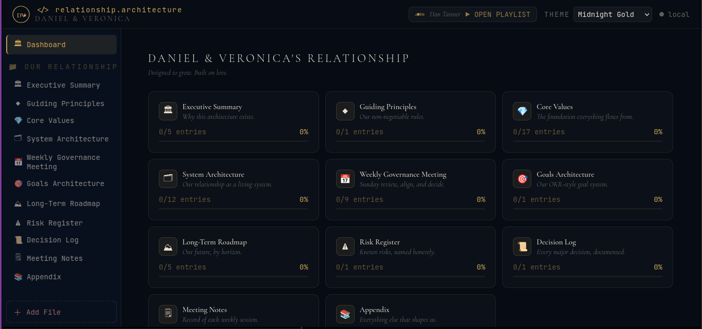
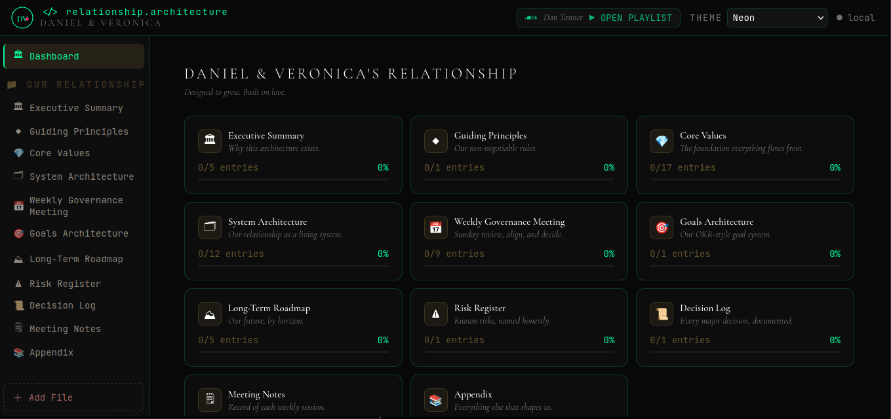
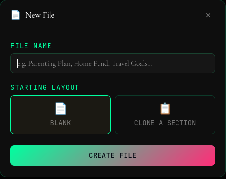
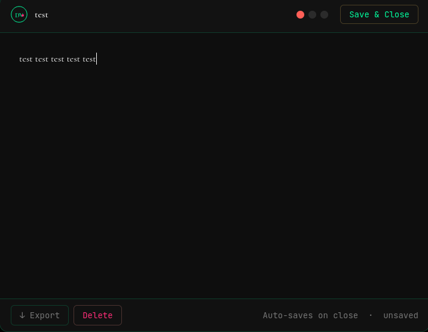
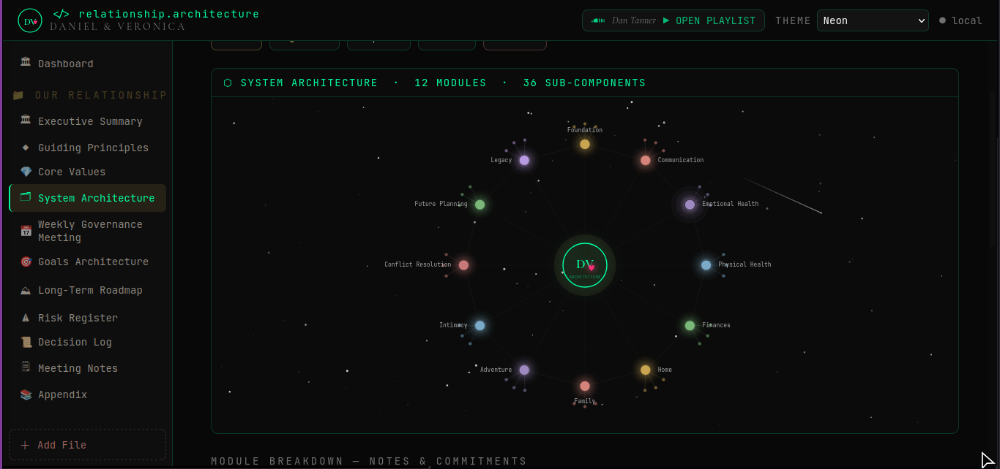
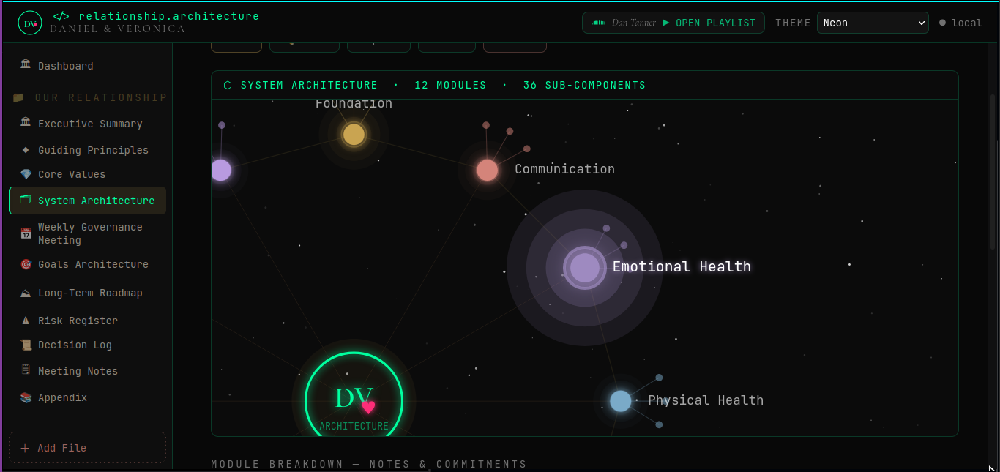
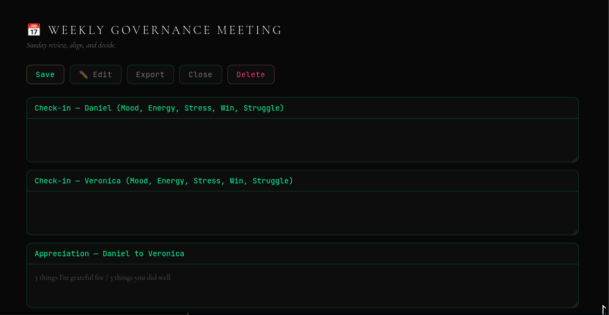

# Relationship Architect

A structured software-inspired relationship system designed to model communication, trust, emotional states, and long-term relational development using principles from software architecture.

---

## System Overview

This repository is composed of four primary components:

- `index.html` → Live interactive application
- `/docs/framework-architecture.md` → System design and behavioral architecture
- `/docs/full-code-reference.md` → Complete implementation reference and audit layer
- `/docs/original-structure.pdf` → Foundational 21-page conceptual document

---

## Design Philosophy

This project treats a relationship as a structured, evolving system rather than an unstructured emotional process.

Core principles:
- Structure over assumption
- Documentation over memory
- Iteration over perfection
- Systems thinking applied to human connection

---
## Screenshots

### Interface Overview

## Repository Structure

relationship-architect/
│
├── index.html
├── README.md
├── /docs
│ ├── framework-architecture.md
│ ├── full-code-reference.md
│ └── original-structure.pdf

---

## Purpose

This repository serves three functions:

1. **Functional System**
   - A working prototype interface (`index.html`)

2. **Architectural Model**
   - Defines how the system behaves (`framework-architecture.md`)

3. **Reference & History**
   - Preserves implementation and origin documents

---

## Version Intent (Future Structure)

This system is intended to evolve through versioned iterations:

- v0.x → initial architecture definition
- v1.x → stabilized behavioral system
- v2.x → optimization and refinement layer
